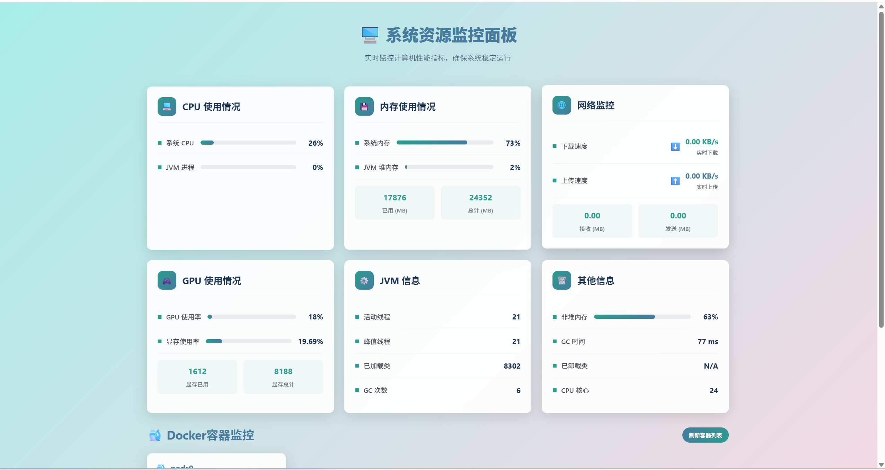
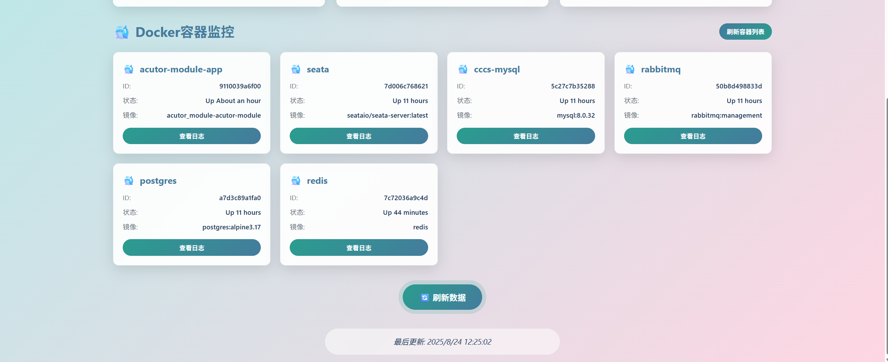
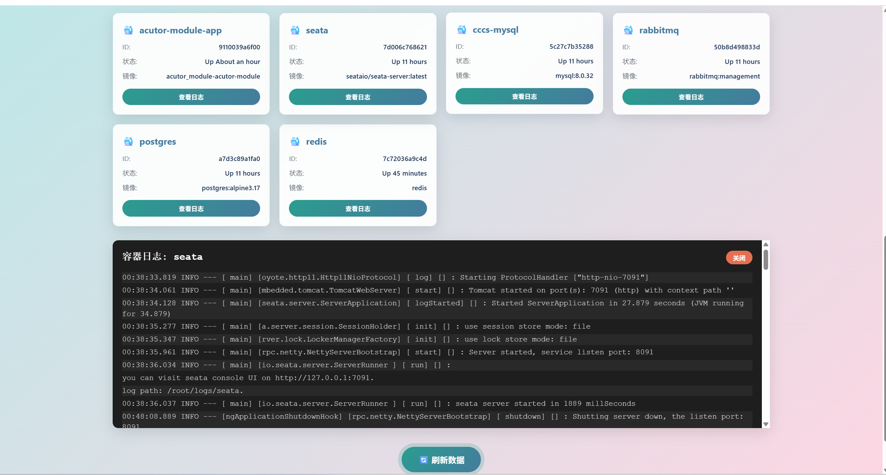

# 系统资源监控应用

这是一个基于Spring Boot的系统资源监控应用，可以监控CPU、内存、网络、GPU等系统资源使用情况，并提供Docker容器监控功能。

## UI页面




## 功能特性

### 系统资源监控
- 实时监控CPU使用率（系统和JVM进程）
- 实时监控内存使用情况（系统和JVM内存）
- 实时监控网络速度（下载和上传速度）
- GPU使用情况监控（支持NVIDIA显卡）

### JVM监控
- JVM线程信息监控
- 类加载情况监控
- 垃圾回收(GC)信息监控

### Docker容器监控
- Docker容器列表查看
- Docker容器实时日志查看
- 容器状态监控

### 用户界面
- 响应式Web界面，支持实时刷新
- 通过WebSocket实现数据实时推送

## 界面功能详情

### 系统资源监控区域
- **CPU监控**: 系统CPU使用率、JVM进程CPU使用率
- **内存监控**: 系统内存使用率、JVM堆内存使用率、非堆内存使用率
- **网络监控**: 下载速度、上传速度、总接收和发送数据量
- **GPU监控**: GPU使用率、GPU显存使用率、GPU显存已用和总计

### JVM监控区域
- **线程信息**: 活动线程数、峰值线程数
- **类加载信息**: 已加载类数量、已卸载类数量
- **垃圾回收信息**: GC次数、GC时间、CPU核心数

### Docker容器监控区域
- **容器列表**: 以卡片形式展示所有运行中的Docker容器
- **容器详细信息**: 容器ID、状态、镜像、镜像大小等信息
- **容器日志查看**: 点击"查看日志"按钮可查看特定容器的实时日志输出

### 实时更新功能区域
- **自动刷新**: 通过WebSocket实现数据的实时推送和界面自动更新（每2秒刷新一次）
- **手动刷新按钮**: 提供手动刷新数据的功能
- **最后更新时间**: 显示数据最后更新的时间戳

## 构建和部署

### 方式一：使用脚本构建和部署（推荐）

#### Linux/macOS:
```bash
chmod +x build-and-deploy.sh
./build-and-deploy.sh
```

#### Windows:
```cmd
build-and-deploy.bat
```

### 方式二：手动构建和部署

1. 构建Spring Boot应用:
```bash
mvn clean package -DskipTests
```

2. 构建Docker镜像:
```bash
docker build -t monitor_module:latest .
```

3. 启动容器:
```bash
docker-compose up -d
```

## 访问应用

应用启动后，可以通过以下地址访问:
- http://localhost (使用80端口)

## 查看日志

使用以下命令查看应用运行日志:
```bash
docker-compose logs -f
```

或者:
```bash
docker logs -f monitor_module-app
```

## 停止应用

```bash
docker-compose down
```

或者:
```bash
docker stop monitor_module-app
docker rm monitor_module-app
```

## 系统要求

- Java 8 或更高版本
- Maven 3.6 或更高版本
- Docker 18.09 或更高版本
- Docker Compose 1.25 或更高版本（可选，如果使用docker-compose命令）

## 注意事项

1. 在Linux系统中，如果需要监控GPU信息，请确保已安装NVIDIA驱动和nvidia-smi工具
2. 网络监控功能需要相应的系统权限
3. 应用默认监听8080端口，但通过Docker映射到主机的80端口
4. 要使用Docker容器监控功能，需要挂载Docker套接字(-v /var/run/docker.sock:/var/run/docker.sock)
5. 如果在Docker容器中运行此应用，必须挂载Docker套接字才能访问宿主机的Docker守护进程
6. 当前Docker镜像基于Alpine Linux，已针对该系统正确安装Docker客户端
7. Dockerfile设计为直接复制已构建的jar包，需要先执行Maven构建
8. 通过挂载/var/run/docker.sock，容器内的应用可以与宿主机的Docker守护进程通信
9. 在某些Linux发行版中，可能需要将运行容器的用户添加到docker组以获得访问权限
10. 如果遇到"permission denied"错误，请尝试以下解决方案：
    - 将当前用户添加到docker组：`sudo usermod -aG docker $USER`
    - 重启Docker服务：`sudo systemctl restart docker`
    - 使用具有足够权限的用户运行容器
    - 检查/var/run/docker.sock文件的权限设置
    - 在docker-compose.yml中添加privileged: true配置项
    - 在docker run命令中添加--privileged参数
11. 如果添加用户到docker组后仍然遇到权限问题，请尝试注销并重新登录，或者运行newgrp docker命令
12. 如果以上方法都不起作用，可以检查Docker套接字文件的权限：ls -l /var/run/docker.sock
13. 确保宿主机上的Docker服务正在运行：sudo systemctl status docker